# Capturas — flujo real, no mockups

Sustituto provisional del video de [WALKTHROUGH.md](WALKTHROUGH.md) mientras no se graba: las
mismas escenas, capturadas contra el stack real (`docker compose up`) con `agent-browser`, un
tenant nuevo (`portafolio`) creado en el momento, y datos 100% sintéticos. Ningún paso está
simulado en el frontend — cada pantalla es la respuesta real de la API tras la acción anterior.

---

## 1–2. Arranque y aislamiento de roles

| | |
|---|---|
| 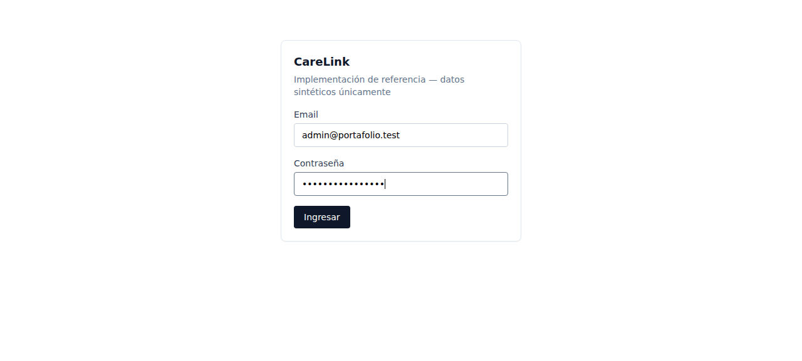 | Pantalla de login. |
| 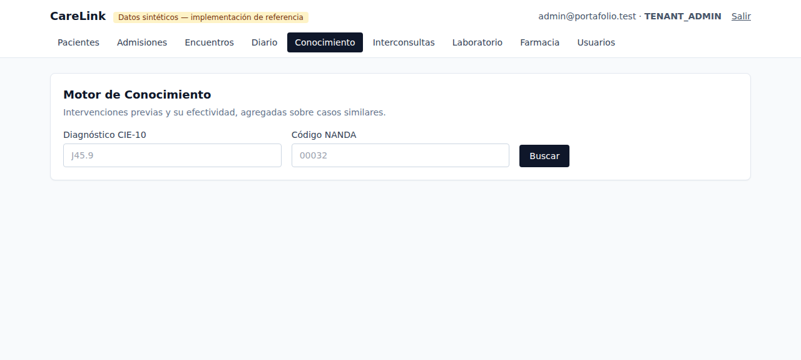 | `TENANT_ADMIN` recién logueado — nav completa, los nueve módulos. |
| 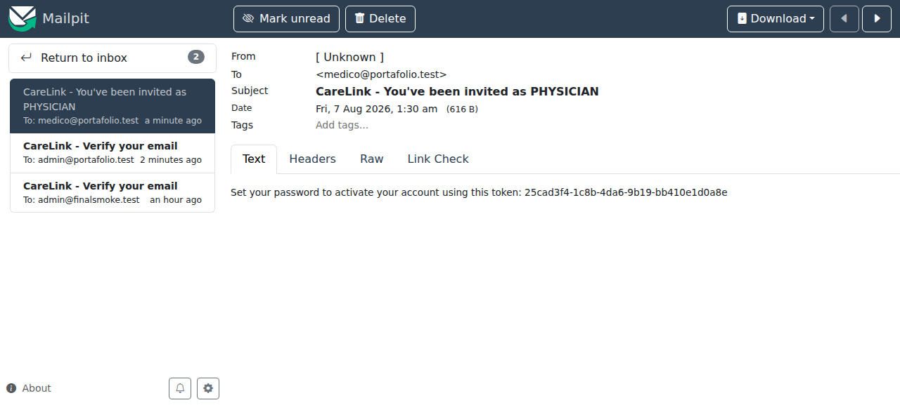 | La invitación a un `PHYSICIAN` capturada por Mailpit, con el token real — mismo mecanismo que usaría un SMTP de producción. |
| 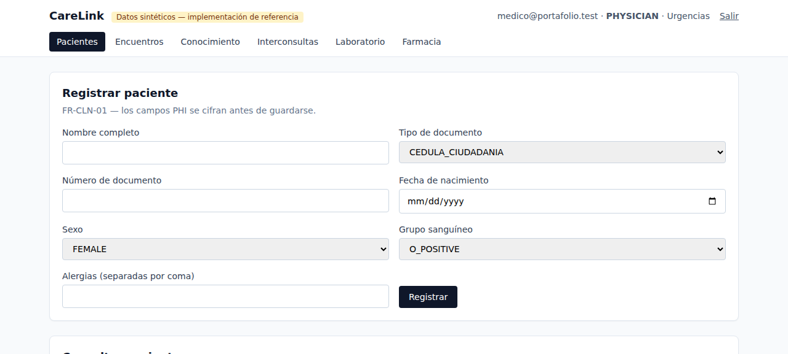 | El mismo usuario, ya logueado como `PHYSICIAN`: nav reducida a **Pacientes, Encuentros, Conocimiento, Interconsultas, Laboratorio, Farmacia** — sin Admisiones, Diario ni Usuarios. Ocultar el botón es UX; el control real es que cada endpoint valida rol+tenant+servicio por su cuenta (ver más abajo el 409 y el 403 sobre el mismo JWT). |
| 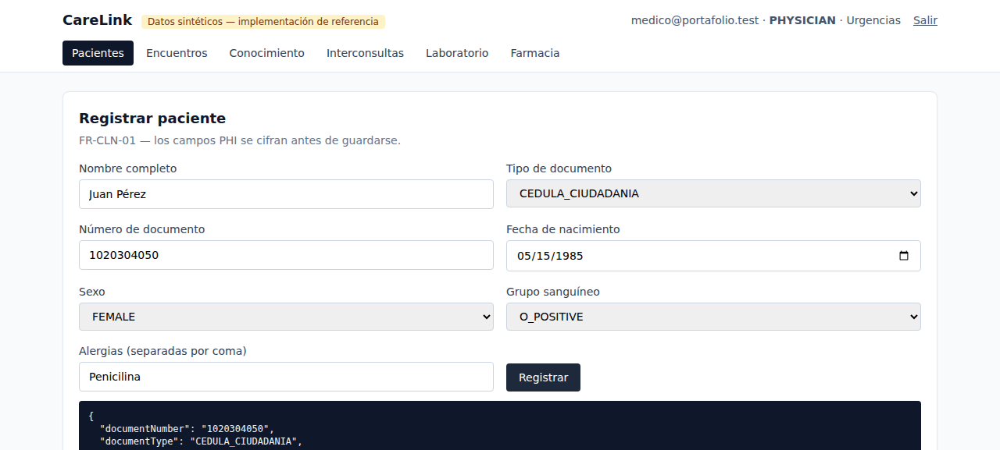 | Paciente registrado — la respuesta de la API confirma los campos PHI. |

## 3. Historia clínica inmutable

| | |
|---|---|
| 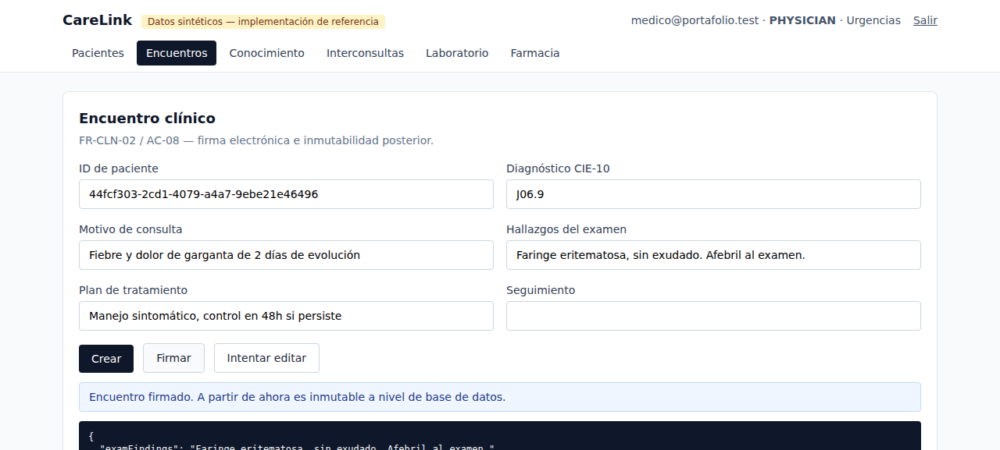 | Encuentro firmado — `signed: true`, `signedAt` con timestamp real. |
| 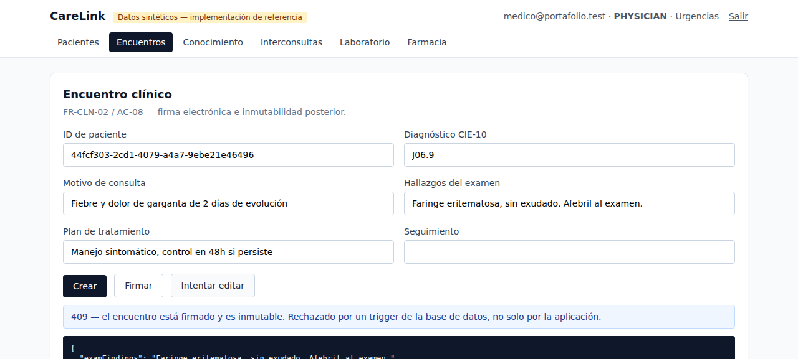 | El mismo `PHYSICIAN` intenta editarlo: **409**, rechazado por un trigger de PostgreSQL, no por una validación de la aplicación que un acceso directo a la base podría saltear. |

## 4. Motor de conocimiento y k-anonimato — la escena más fuerte para seguridad

| | |
|---|---|
| 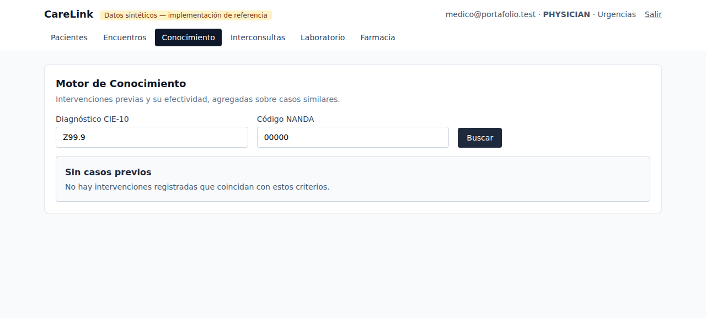 | Diagnóstico sin ningún caso cargado → **"Sin casos previos"**. |
| 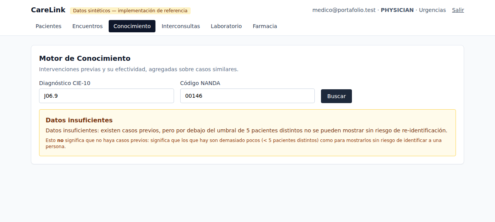 | Mismo diagnóstico, ahora con 3 pacientes distintos con la misma intervención (por debajo del umbral k=5) → **"Datos insuficientes"**, un estado distinto a propósito. El umbral se aplica en un `HAVING COUNT(DISTINCT patient_id) >= 5` dentro del SQL — no hay fila que "casi" se muestre y se filtre después. |

## 5. Revocación de acceso en tiempo real

| | |
|---|---|
| 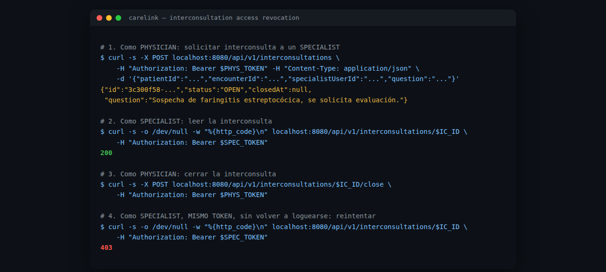 | Terminal real: el `SPECIALIST` lee la interconsulta (200), el `PHYSICIAN` la cierra, y el **mismo JWT del especialista, sin volver a loguearse**, cae a 403 en el siguiente request. El acceso no vive en una tabla de permisos — cada request pregunta "¿hay una interconsulta abierta ahora mismo?". |

## 6. Laboratorio: valor crítico

| | |
|---|---|
| 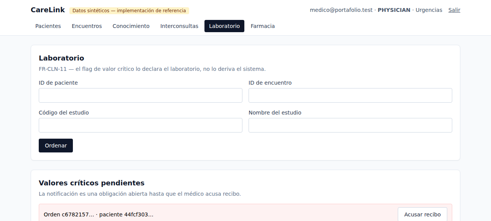 | El `LAB_TECH` carga un resultado marcado como crítico; el `PHYSICIAN` solicitante ve la notificación pendiente al volver a Laboratorio — una obligación abierta hasta que la acusa recibo, no un evento que se pierde. |

---

**Nota de reproducibilidad:** todas las capturas usan un tenant (`portafolio`) y usuarios
(`admin@portafolio.test`, `medico@portafolio.test`, `enfermera@portafolio.test`,
`especialista@portafolio.test`, `labtech@portafolio.test`) creados exclusivamente para esta
sesión de capturas, con contraseñas sintéticas que no se reutilizan en ningún otro entorno.
